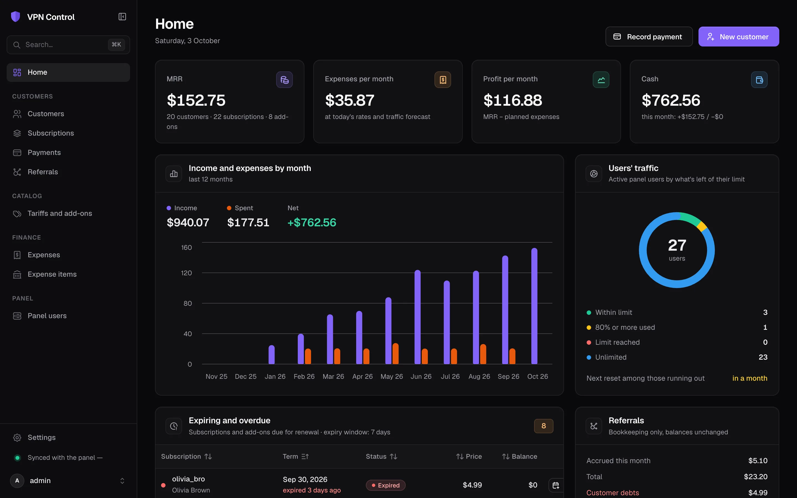
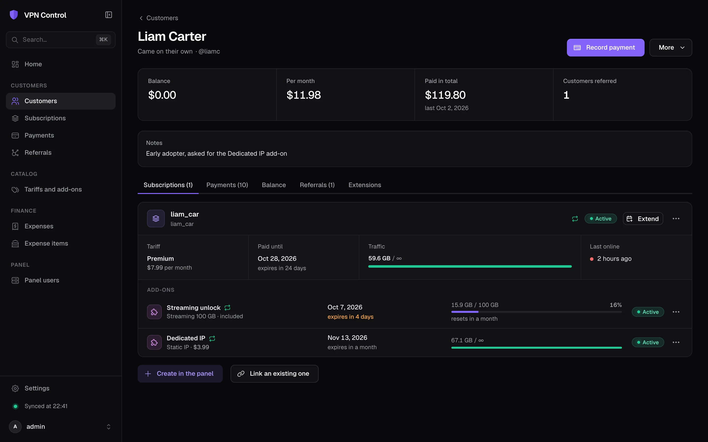
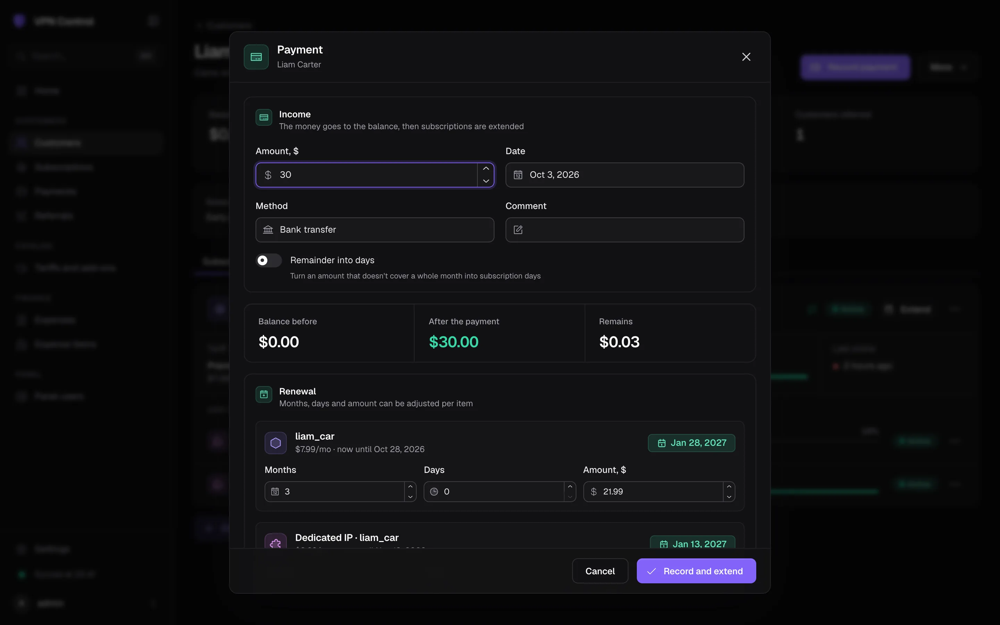
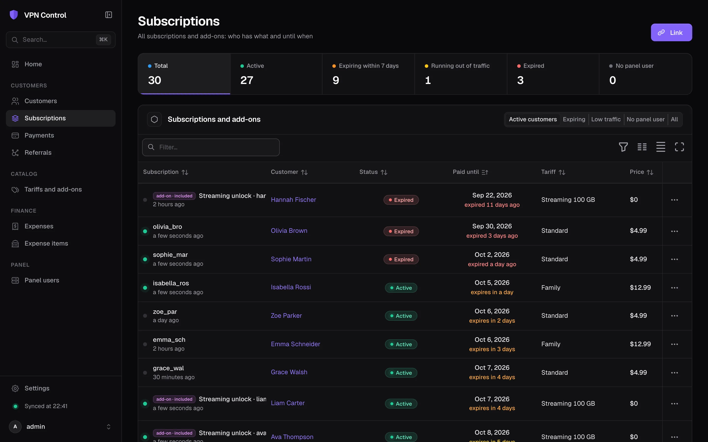
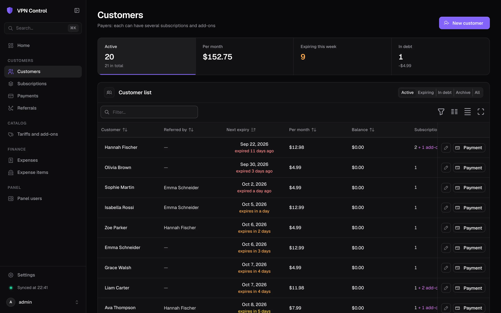
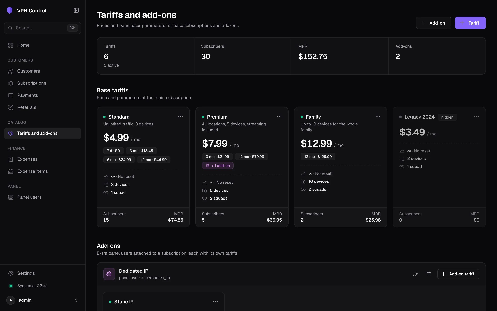
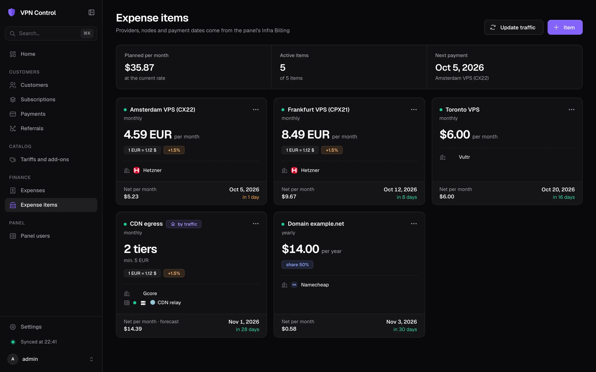
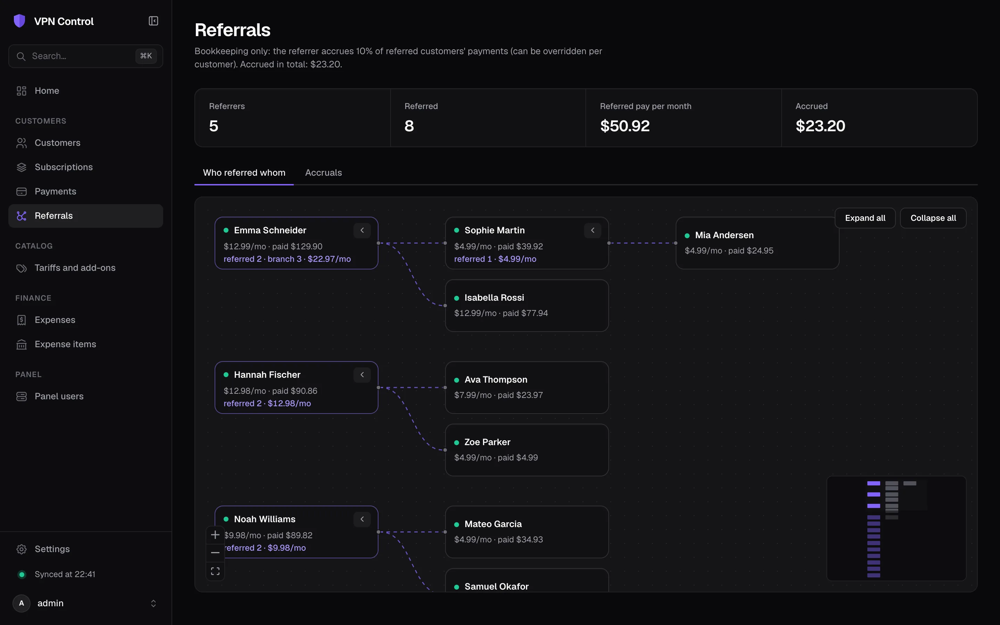

<div align="center">


# VPN Control

**A back office for VPN services running on [Remnawave](https://github.com/remnawave/panel)**

Customers, subscriptions, payments with auto-renewal, tariffs, add-ons, referrals and infrastructure costs, all in one place and synced with your panel.

[](go.mod)
[](web/package.json)
[](web/package.json)
[](internal/store)
[](LICENSE)
[](https://github.com/lentryd/vpn-control/releases)
[](https://github.com/lentryd/vpn-control/actions/workflows/test.yaml)

**English** · [Русский](README.ru.md)



</div>

## Why

Remnawave manages VPN users well, but it doesn't track money. Who paid, for how long, what they owe, who referred them, and what the servers cost: these usually end up in a spreadsheet. VPN Control keeps that bookkeeping and pushes the result to the panel. A recorded payment extends the right panel users, and a tariff change updates their limits and squads.

## Features

- **Customers and subscriptions.** A paying customer can have several subscriptions (Remnawave users), and each subscription can have add-ons.
- **Terms at a glance.** A dashboard, expiry filters, and status and traffic from the panel show who expires when.
- **Payments with auto-renewal.** A payment goes to the customer's balance. A preview shows how many months it covers for which subscriptions and add-ons. Once you confirm, the new `expireAt` values go to the panel and any remainder stays on the balance.
- **Tariffs.** Base and add-on tariffs with a price, term discounts (3/6/12 months, trial days), traffic limit, reset strategy, HWID limit and squads. A subscription can have a custom price. Changing the tariff prices the rest of the term.
- **Add-ons.** An add-on is a separate panel user named `prefix + <username> + suffix` whose configs are appended to the main subscription (by [subpage](#add-ons-and-the-api) or a similar service). You can manage add-ons in the UI or load them from a file, and other services fetch the catalog over the API.
- **Tariffs with included add-ons.** A base tariff can include add-ons. These are connected for free and are extended, enabled and disabled together with the subscription.
- **Referrals.** A "who referred whom" tree, with bookkeeping accruals of X% of referred customers' payments. Accruals don't change balances.
- **Expenses in any currency.** Amounts are converted to the base currency at the date's rate (Bank of Russia, ECB). You can add a bank fee and a cost share. The converted amount is fixed when the expense is recorded. Refunds are kept separately.
- **Traffic-metered expenses.** For CDNs and per-GB transit, the cost comes from a node's traffic, with a forecast for the period and the top consumers. See [Metered pricing](#metered-pricing).
- **Backups.** Export and import by category, scheduled snapshots, and snapshot download over the API.
- **English and Russian UI.** It installs as a PWA. Offline, it shows cached data and disables changes.

## Screenshots

<table>
  <tr>
    <td width="50%"><br><sub><b>Customer:</b> balance, subscriptions, add-ons, traffic and payment history</sub></td>
    <td width="50%"><br><sub><b>Payment:</b> a preview of what it extends and until when</sub></td>
  </tr>
  <tr>
    <td><br><sub><b>Subscriptions:</b> status, terms and traffic from the panel</sub></td>
    <td><br><sub><b>Customers:</b> next expiry, monthly revenue, balance and debt</sub></td>
  </tr>
  <tr>
    <td><br><sub><b>Tariffs:</b> term discounts, limits, squads and included add-ons</sub></td>
    <td><br><sub><b>Expense items:</b> fixed and per-GB costs in any currency</sub></td>
  </tr>
  <tr>
    <td colspan="2"><br><sub><b>Referrals:</b> who referred whom and how much they bring in</sub></td>
  </tr>
</table>

<sub>The screenshots show made-up demo data.</sub>

## Quick start

You need a Remnawave panel and Docker. VPN Control runs as a separate container in the panel's docker network. A ready image is published at `ghcr.io/lentryd/vpn-control` for `linux/amd64` and `linux/arm64`, so you don't need to clone or build anything.

1. In the panel, create an API token (**API tokens**) with the scopes `users:*`, `internal-squads:read`, `nodes:read`, `bandwidth-stats:read` and `infra-billing:read`, or with `*`.
2. On the server, make a folder and download the example [`compose.yml`](compose.yml) and [`.env.example`](.env.example) into it:

   ```bash
   mkdir vpn-control && cd vpn-control
   curl -fsSL -o compose.yml https://raw.githubusercontent.com/lentryd/vpn-control/main/compose.yml
   curl -fsSL -o .env https://raw.githubusercontent.com/lentryd/vpn-control/main/.env.example
   ```

3. Fill in `.env`: `REMNAWAVE_TOKEN`, `APP_DOMAIN` and `JWT_SECRET` (`openssl rand -hex 32`). Check `REMNAWAVE_NETWORK`, `TRAEFIK_CERTRESOLVER` and `TRAEFIK_ENTRYPOINTS` against your panel's setup.
4. Start it:

   ```bash
   docker compose up -d
   ```

5. Open `https://$APP_DOMAIN/` and sign in with your panel admin username and password.

`compose.yml` is only an example. Change it to fit your server, or copy the service into the panel's own compose file.

### Updating

```bash
docker compose pull && docker compose up -d
```

The data lives in the `vpn-control-data` volume and survives updates. Migrations run on start, and a snapshot is taken on schedule (see [Backups](#backups)). To pin a version, use a release tag instead of `latest`, for example `image: ghcr.io/lentryd/vpn-control:1.0.0`. Releases are listed on the [Releases](https://github.com/lentryd/vpn-control/releases) page.

### Deployment notes

- The container joins the panel's docker network (`REMNAWAVE_NETWORK`, default `remnawave-network`) and talks to the backend directly at `http://remnawave:3000`. It sets the `X-Forwarded-*` headers the panel requires.
- Traefik labels serve the app at `https://$APP_DOMAIN/`. The app needs its own domain, for example a subdomain of the panel's.
- **Without Traefik:** the app listens on `HOST_PORT`, so put any reverse proxy in front of it and drop the `labels`. Keep HTTPS, or set `SECURE_COOKIE=false` for a plain-HTTP local run.
- **Traefik on another host through frp:** tunnel `HOST_PORT` to the Traefik side and point the service label at the tunnelled port. For [frp](https://github.com/fatedier/frp) with docker labels, for example:

  ```yaml
  labels:
      # ...the router labels above, then:
      - 'traefik.http.services.vpn-control.loadbalancer.server.port=1${HOST_PORT:-8080}'
      - 'frp.enable=true'
      - 'frp.name=vpn-control'
      - 'frp.local_port=${HOST_PORT:-8080}'
      - 'frp.remote_port=1${HOST_PORT:-8080}'
  ```

- **Login.** Admins sign in with their panel credentials. The app checks them with `POST /api/auth/login` and issues its own session. If the panel only allows OAuth or passkeys, set `ADMIN_PASSWORD` for a local login.
- **Add-ons file (optional).** Put `addons.yml` next to `compose.yml`, or point `ADDONS_FILE` at another one, for example subpage's. Without it, add-ons are managed in the UI.

### Webhooks (optional)

Webhooks update statuses instantly. In the panel's `.env`, set:

- `WEBHOOK_ENABLED=true`
- `WEBHOOK_URL=https://<APP_DOMAIN>/api/webhooks/remnawave`. The panel only accepts `https://`, so the webhook goes through its Traefik.
- the same secret in the panel's `WEBHOOK_SECRET_HEADER` and in `WEBHOOK_SECRET` here.

Without webhooks, data is synced every `SYNC_INTERVAL` (10 minutes by default) and with the ⟳ button.

## Configuration

Everything is set through environment variables. See [`.env.example`](.env.example) for the full list. The main ones:

| Variable | Default | Meaning |
|---|---|---|
| `REMNAWAVE_URL`, `REMNAWAVE_TOKEN` | — | Panel backend and API token (required) |
| `JWT_SECRET` | — | Signs admin sessions (required) |
| `APP_DOMAIN` | — | Domain Traefik serves the app at |
| `ADMIN_USERNAME`, `ADMIN_PASSWORD` | `admin`, empty | Local fallback login; an empty password turns it off |
| `TZ` | `UTC` | Time zone used to show dates and to cut periods |
| `SYNC_INTERVAL` | `10m` | Panel users sync |
| `TRAFFIC_SYNC_INTERVAL` | `1h` | Node traffic sync for metered expenses |
| `ADDONS_FILE` / `ADDONS_CONFIG` | `./addons.yml` | Optional add-ons file (host path / path inside the app) |
| `DB_PATH` | `./data/vpn-control.db` | SQLite database |

These settings are edited in the UI (**Settings**):

- **Base currency.** Payments, balances and expense totals are kept in it. Rates come from the Bank of Russia for RUB and from the ECB for EUR, USD, GBP, CHF, PLN and others. You can change it only while there are no payments or expenses yet.
- **Referral percent**, the **"expiring soon" window** and the **default currency fee**.
- **Backup schedule**: how often snapshots are taken and how many are kept.

## Metered pricing

A "by traffic" expense item takes its traffic from a panel node, optionally only from the members of one internal squad on it. It is then priced the way the provider bills:

- **GB unit:** binary (1 GB = 1024³ bytes) or decimal (10⁹ bytes).
- **Minimum:** either *minimum charge*, where cost = `max(minimum, GB × price)`, or *fee + free allowance*, where cost = `fee + (GB − free GB) × price`.
- **Price:** a flat price per GB or graduated tiers ("up to 10 000 GB at X, then Y").
- **Period start day:** 1–28, for billing cycles that don't start on the 1st.

Examples:

| Provider | GB unit | Minimum | Price |
|---|---|---|---|
| Yandex Cloud CDN | binary | minimum charge | flat per GB |
| Bunny, Gcore | decimal | minimum charge (or none) | tiers by volume |
| Plans with included traffic | decimal | fee + free allowance | overage per GB |

**Close period** books the calculated cost as an expense. When the invoice arrives, change the amount to the invoiced one. The calculated value is kept for comparison.

## Add-ons and the API

Add-ons come from two sources:

- **The UI** (**Tariffs → Add-ons**): name, prefix and suffix, plus subpage's config names (`remark`, `remarkUnlimited`) and stubs.
- **An add-ons file** in subpage's `addons.yml` format (`ADDONS_FILE`). Add-ons from the file are read-only in the UI.

A base tariff can **include add-ons**: pick their add-on tariffs on the tariff. When you change the list, you can apply it to current subscribers right away. Otherwise it applies on their next tariff change. When a subscription moves to a tariff without one of its included add-ons, you choose whether to disable the add-on or keep it as a paid one.

The public API covers everything the UI does — customers, payments and balance, subscriptions and add-ons, extensions and tariff changes, tariffs, referrals, expenses, Remnawave data and stats — so you can build bots and other integrations on it. Create a token in **Settings → API tokens**, as in the panel: a name, an expiry in days and scopes per resource (Read/Write or single endpoints; presets: read only, full access, subpage). A token is shown once, and only a hash of it is stored. Then call the API:

```bash
curl -H "Authorization: Bearer vpc_…" https://control.example.com/api/v1/addons              # JSON
curl -H "Authorization: Bearer vpc_…" "https://control.example.com/api/v1/addons?format=yaml" # addons.yml
```

| Endpoint | Endpoint key | |
|---|---|---|
| `GET /api/v1/customers` | `customers:list` | List customers |
| `GET /api/v1/customers/{id}` | `customers:get` | Customer with balance, ledger, subscriptions and payments |
| `POST /api/v1/customers` | `customers:create` | Create a customer |
| `PUT /api/v1/customers/{id}` | `customers:update` | Update a customer |
| `DELETE /api/v1/customers/{id}` | `customers:delete` | Delete (archive) a customer |
| `POST /api/v1/customers/{id}/payments/preview` | `customers:payment_preview` | Preview a payment: split, referral, resulting balance |
| `POST /api/v1/customers/{id}/payments` | `customers:pay` | Record a payment (to balance and/or extensions) |
| `POST /api/v1/customers/{id}/adjust` | `customers:adjust` | Adjust the balance |
| `GET /api/v1/payments` | `payments:list` | List payments |
| `PUT /api/v1/payments/{id}` | `payments:update` | Update a payment |
| `DELETE /api/v1/payments/{id}` | `payments:delete` | Delete a payment |
| `GET /api/v1/subscriptions` | `subscriptions:list` | List subscriptions |
| `POST /api/v1/subscriptions` | `subscriptions:create` | Link a Remnawave user as a subscription |
| `POST /api/v1/subscriptions/provision` | `subscriptions:provision` | Create a Remnawave user and its subscription |
| `PUT /api/v1/subscriptions/{id}` | `subscriptions:update` | Update a subscription |
| `DELETE /api/v1/subscriptions/{id}` | `subscriptions:delete` | Unlink a subscription |
| `POST /api/v1/subscriptions/{id}/addons` | `subscriptions:connect_addon` | Connect an add-on |
| `PUT /api/v1/subscription-addons/{id}` | `subscriptions:update_addon` | Update a connected add-on |
| `DELETE /api/v1/subscription-addons/{id}` | `subscriptions:delete_addon` | Unlink a connected add-on |
| `GET /api/v1/items/{kind}/{id}/quote` | `items:quote` | Quote an extension (kind: subscription | addon) |
| `POST /api/v1/items/{kind}/{id}/extend` | `items:extend` | Extend from the balance |
| `GET /api/v1/items/{kind}/{id}/tariff-quote` | `items:tariff_quote` | Quote a tariff change |
| `POST /api/v1/items/{kind}/{id}/tariff` | `items:tariff` | Change the tariff |
| `POST /api/v1/items/{kind}/{id}/enable` | `items:enable` | Enable in Remnawave |
| `POST /api/v1/items/{kind}/{id}/disable` | `items:disable` | Disable in Remnawave |
| `GET /api/v1/tariffs` | `tariffs:list` | List tariffs |
| `POST /api/v1/tariffs` | `tariffs:create` | Create a tariff |
| `PUT /api/v1/tariffs/{id}` | `tariffs:update` | Update a tariff |
| `DELETE /api/v1/tariffs/{id}` | `tariffs:delete` | Delete a tariff |
| `POST /api/v1/tariffs/{id}/sync-included` | `tariffs:sync_included` | Sync included add-ons to subscriptions |
| `GET /api/v1/addons` | `addons:list` | The add-on catalog; `?format=yaml` returns subpage's file format |
| `GET /api/v1/addons/full` | `addons:full` | Add-ons with all fields |
| `POST /api/v1/addons` | `addons:create` | Create an add-on |
| `PUT /api/v1/addons/{id}` | `addons:update` | Update an add-on |
| `DELETE /api/v1/addons/{id}` | `addons:delete` | Delete an add-on |
| `GET /api/v1/referrals/tree` | `referrals:tree` | Referral tree |
| `GET /api/v1/referrals/accruals` | `referrals:accruals` | Referral accruals |
| `GET /api/v1/expenses` | `expenses:list` | List expenses |
| `POST /api/v1/expenses` | `expenses:create` | Create an expense |
| `PUT /api/v1/expenses/{id}` | `expenses:update` | Update an expense |
| `DELETE /api/v1/expenses/{id}` | `expenses:delete` | Delete an expense |
| `GET /api/v1/expenses/providers` | `expenses:providers` | Spending by provider |
| `GET /api/v1/expense-items` | `expenses:items` | List expense items |
| `POST /api/v1/expense-items` | `expenses:item_create` | Create an expense item |
| `PUT /api/v1/expense-items/{id}` | `expenses:item_update` | Update an expense item |
| `DELETE /api/v1/expense-items/{id}` | `expenses:item_delete` | Delete an expense item |
| `GET /api/v1/expense-items/{id}/metered` | `expenses:item_metered` | Metered usage of an item |
| `POST /api/v1/expense-items/{id}/close-period` | `expenses:item_close_period` | Close a metered period |
| `POST /api/v1/traffic/sync` | `expenses:traffic_sync` | Sync traffic now |
| `GET /api/v1/rw/users` | `remnawave:users` | Remnawave users |
| `GET /api/v1/rw/squads` | `remnawave:squads` | Squads |
| `GET /api/v1/rw/nodes` | `remnawave:nodes` | Nodes |
| `GET /api/v1/rw/infra` | `remnawave:infra` | Infrastructure |
| `GET /api/v1/rw/sync` | `remnawave:sync_status` | Sync status |
| `POST /api/v1/rw/sync` | `remnawave:sync` | Sync now |
| `GET /api/v1/dashboard` | `stats:dashboard` | Dashboard figures |
| `GET /api/v1/fx/rate` | `stats:fx_rate` | Exchange rate |
| `GET /api/v1/settings` | `stats:settings` | Settings (read only) |
| `GET /api/v1/audit` | `stats:audit` | Audit log |
| `GET /api/v1/backups` | `backups:list` | List snapshots |
| `GET /api/v1/backups/{name}` | `backups:download` | Download a snapshot |
| `POST /api/v1/backups` | `backups:create` | Take a snapshot and download it |

Scopes follow the panel's grammar: `*`, `<resource>:*`, `<resource>:read`, `<resource>:write` or an endpoint key from the table.

Requests and responses are the same JSON as the UI uses (money in major units). Errors come as `{"message", "code", "params"}`; a missing or expired token gives `401`, a token without the scope `403`. Actions made with a token show in the audit log as `token:<name>`.

## Backups

In **Settings → Backups**:

- **Snapshots** are full copies of the database in `data/backups`. They are taken on a schedule, by hand, and automatically before every import. You can download them, restore them by category, or fetch them over the API.
- **Export** writes the selected categories to a zip archive: a `manifest.json` plus one JSON file per table. IDs and dates are kept as they are.
- **Import** replaces the selected categories in a single transaction. If the result would leave references to missing rows (for example, subscriptions without customers), the import is rolled back. The current data is saved as a pre-import snapshot first.

## Development

Requirements: Go 1.26, [Bun](https://bun.sh) and [Task](https://taskfile.dev).

```bash
task init      # .env, frontend dependencies
task dev       # API on :8080 and the Bun dev server on :5173 (proxies /api)
task test      # go test, frontend type check and locale key check
task build     # bin/vpn-control with the embedded UI
task lint      # go mod tidy, go fmt, go vet and golangci-lint
task docker    # local image ko.local/vpn-control:dev (needs ko and Docker)
```

For a local run, set `SECURE_COOKIE=false` and an `ADMIN_PASSWORD` in `.env`. The app still needs a reachable panel for `REMNAWAVE_URL`. `go run . --no-sync` skips the background sync.

- Stack: Go, Fiber, Ent and SQLite (no CGO) on the backend; Mantine 9, mantine-react-table, TanStack Query and i18next on the frontend. The built UI is embedded in the binary.
- After editing `ent/schema`, run `task ent:generate`. Migrations run automatically on start.
- UI strings live in `web/public/locales/{en,ru}/vpn-control.json`. Keys are type-checked against the English file, and `bun run i18n:check` checks that every locale has the same keys. To add a language, add a folder there and list the language in `web/src/app/i18n/i18n.ts`.
- API errors carry a `code` (with `params`) that the UI translates (`errors.*` in the locales), plus an English `message` as a fallback.

### Releases

CI ([`.github/workflows`](.github/workflows)) runs the tests, the linters and the frontend type check on every push and pull request. Pushing a `v*` tag runs [GoReleaser](https://goreleaser.com) ([`.goreleaser.yaml`](.goreleaser.yaml)), which:

- builds the binaries for `linux/amd64` and `linux/arm64` with the embedded UI and attaches them to a GitHub release with checksums, a Sigstore signature and SBOMs;
- builds the image with [ko](https://ko.build) and pushes it to `ghcr.io/lentryd/vpn-control` as `<version>` and `latest`.

```bash
git tag v1.0.0 && git push origin v1.0.0
```

`task snapshot` builds the same artifacts locally without publishing them.

## License

[AGPL-3.0](LICENSE). The theme, layout and some UI components are adapted from [remnawave/frontend](https://github.com/remnawave/frontend) (AGPL-3.0). See [`web/THIRD_PARTY.md`](web/THIRD_PARTY.md).

VPN Control is an independent project and is not affiliated with the Remnawave team.
