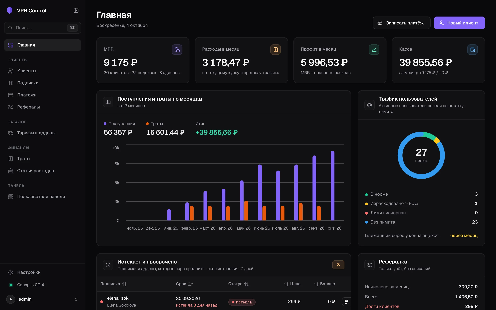
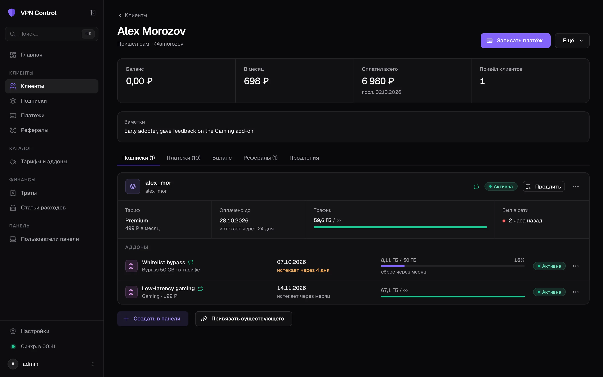
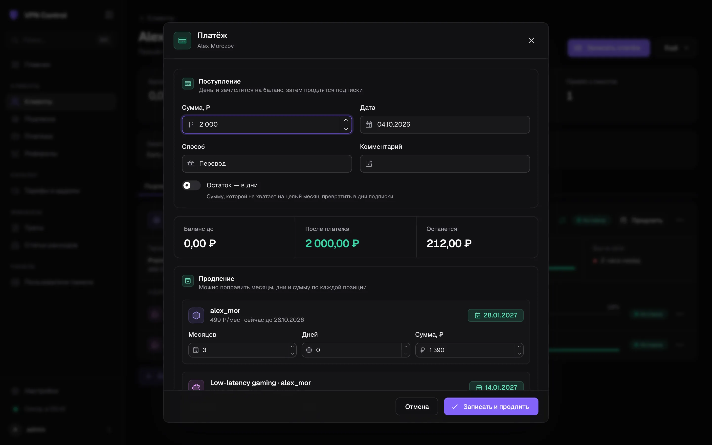
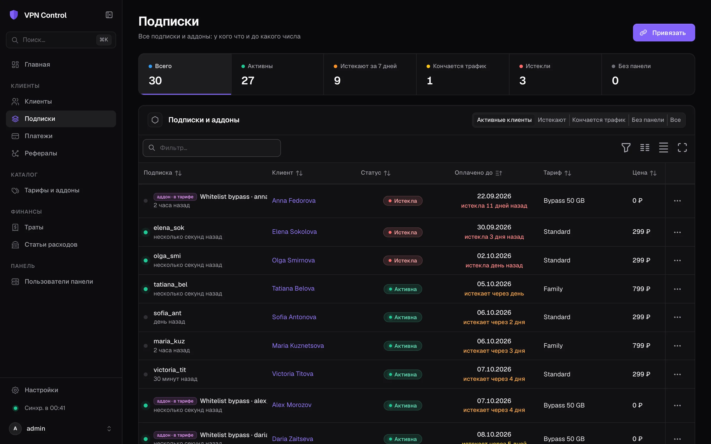
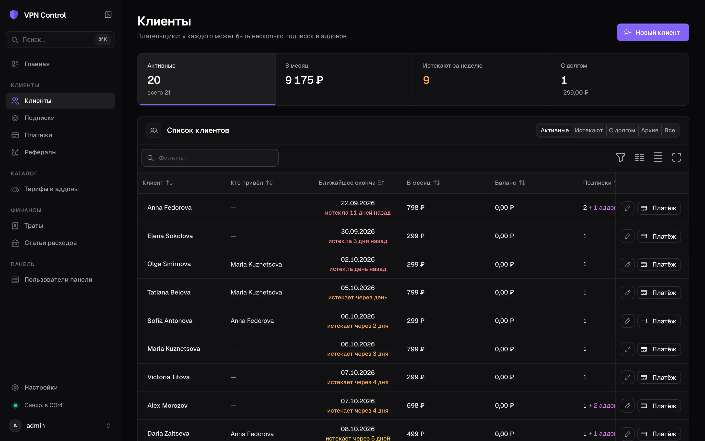
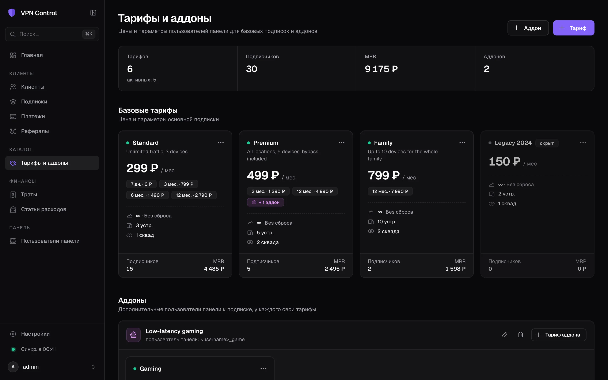
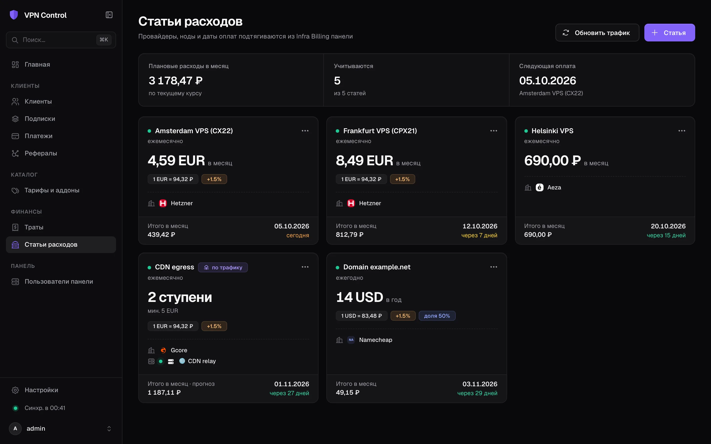
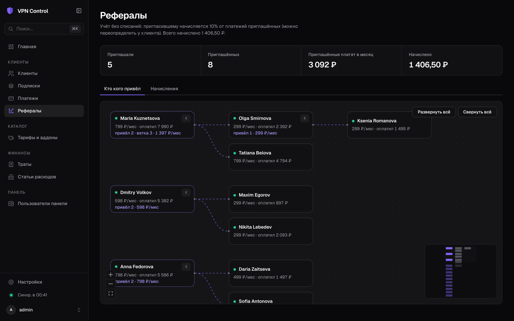

<div align="center">


# VPN Control

**Админка VPN-сервиса поверх панели [Remnawave](https://github.com/remnawave/panel)**

Клиенты, подписки, платежи с автопродлением, тарифы, аддоны, рефералы и расходы на инфраструктуру — в одном месте и в синхронизации с панелью.

[](go.mod)
[](web/package.json)
[](web/package.json)
[](internal/store)
[](LICENSE)
[](https://github.com/lentryd/vpn-control/releases)
[](https://github.com/lentryd/vpn-control/actions/workflows/test.yaml)

[English](README.md) · **Русский**



</div>

## Зачем

Remnawave хорошо управляет пользователями VPN, но не ведёт учёт денег. Кто сколько заплатил, до какого числа, кто должен, кто кого привёл и сколько стоят серверы — обычно всё это живёт в таблице. VPN Control ведёт этот учёт и сам отправляет результат в панель: записанный платёж продлевает нужных пользователей, а смена тарифа меняет их лимиты и сквады.

## Возможности

- **Клиенты и подписки.** У клиента-плательщика может быть несколько подписок (пользователей Remnawave), у каждой подписки — аддоны.
- **Сроки на виду.** Дашборд, фильтры по сроку, статус и трафик из панели показывают, у кого и что заканчивается.
- **Платежи с автопродлением.** Платёж зачисляется на баланс клиента. Предпросмотр показывает, сколько месяцев и на какие подписки и аддоны он покрывает. После подтверждения новые `expireAt` уходят в панель, остаток остаётся на балансе.
- **Тарифы.** Базовые тарифы и тарифы аддонов: цена, скидки за срок (3/6/12 месяцев, пробные дни), лимит трафика, стратегия сброса, HWID, сквады. Подписке можно задать индивидуальную цену. Смена тарифа считает доплату за остаток срока.
- **Аддоны.** Аддон — отдельный пользователь панели `prefix + <username> + suffix`, чьи конфиги добавляются в основную подписку (через [subpage](#аддоны-и-api) или похожий сервис). Аддоны можно вести в интерфейсе или загружать из файла, а другие сервисы получают каталог по API.
- **Тарифы со включёнными аддонами.** В базовый тариф можно включить аддоны. Они подключаются бесплатно и продлеваются, включаются и отключаются вместе с подпиской.
- **Рефералы.** Дерево «кто кого привёл» и учётное начисление X% от платежей приглашённых. Баланс начисления не меняют.
- **Траты в любой валюте.** Сумма переводится в базовую валюту по курсу на дату (ЦБ РФ, ЕЦБ). Можно добавить комиссию банка и долю. Сумма фиксируется при записи, возвраты хранятся отдельно.
- **Тарификация по трафику.** Для CDN и транзита с оплатой за ГБ: стоимость по трафику ноды, прогноз на конец периода и список тех, кто больше всего грузит. См. [Тарификация по трафику](#тарификация-по-трафику).
- **Резервные копии.** Экспорт и импорт по категориям, снапшоты по расписанию, выдача снапшотов по API.
- **Интерфейс на русском и английском.** Устанавливается как PWA. Без сети показывает закэшированные данные, а изменения блокирует.

## Скриншоты

<table>
  <tr>
    <td width="50%"><br><sub><b>Клиент:</b> баланс, подписки, аддоны, трафик и история платежей</sub></td>
    <td width="50%"><br><sub><b>Платёж:</b> предпросмотр — что и до какого числа продлится</sub></td>
  </tr>
  <tr>
    <td><br><sub><b>Подписки:</b> статус, сроки и трафик из панели</sub></td>
    <td><br><sub><b>Клиенты:</b> ближайшее истечение, доход в месяц, баланс и долги</sub></td>
  </tr>
  <tr>
    <td><br><sub><b>Тарифы:</b> скидки за срок, лимиты, сквады и включённые аддоны</sub></td>
    <td><br><sub><b>Статьи расходов:</b> фиксированные траты и оплата за ГБ в любой валюте</sub></td>
  </tr>
  <tr>
    <td colspan="2"><br><sub><b>Рефералы:</b> кто кого привёл и сколько приносит</sub></td>
  </tr>
</table>

<sub>На скриншотах вымышленные демо-данные.</sub>

## Быстрый старт

Нужны панель Remnawave и Docker. VPN Control работает отдельным контейнером в docker-сети панели. Готовый образ публикуется в `ghcr.io/lentryd/vpn-control` для `linux/amd64` и `linux/arm64`, поэтому клонировать и собирать ничего не нужно.

1. Создайте в панели API-токен (**API tokens**) со scope `users:*`, `internal-squads:read`, `nodes:read`, `bandwidth-stats:read`, `infra-billing:read` или просто `*`.
2. На сервере создайте папку и скачайте в неё пример [`compose.yml`](compose.yml) и [`.env.example`](.env.example):

   ```bash
   mkdir vpn-control && cd vpn-control
   curl -fsSL -o compose.yml https://raw.githubusercontent.com/lentryd/vpn-control/main/compose.yml
   curl -fsSL -o .env https://raw.githubusercontent.com/lentryd/vpn-control/main/.env.example
   ```

3. Заполните `.env`: `REMNAWAVE_TOKEN`, `APP_DOMAIN` и `JWT_SECRET` (`openssl rand -hex 32`). Сверьте `REMNAWAVE_NETWORK`, `TRAEFIK_CERTRESOLVER` и `TRAEFIK_ENTRYPOINTS` с настройками своей панели.
4. Запустите:

   ```bash
   docker compose up -d
   ```

5. Откройте `https://$APP_DOMAIN/` и войдите логином и паролем администратора панели.

`compose.yml` — только пример. Подстройте его под свой сервер или перенесите сервис в compose-файл самой панели.

### Обновление

```bash
docker compose pull && docker compose up -d
```

Данные хранятся в volume `vpn-control-data` и переживают обновления. Миграции применяются при старте, снапшоты делаются по расписанию (см. [Резервные копии](#резервные-копии)). Чтобы зафиксировать версию, укажите вместо `latest` тег релиза, например `image: ghcr.io/lentryd/vpn-control:1.0.0`. Список версий — на странице [Releases](https://github.com/lentryd/vpn-control/releases).

### Детали развёртывания

- Контейнер подключается к docker-сети панели (`REMNAWAVE_NETWORK`, по умолчанию `remnawave-network`) и обращается к бэкенду напрямую: `http://remnawave:3000`. Заголовки `X-Forwarded-*`, которые требует панель, сервис выставляет сам.
- Лейблы Traefik отдают приложение по адресу `https://$APP_DOMAIN/`. Ему нужен собственный домен, например поддомен панели.
- **Без Traefik:** приложение слушает `HOST_PORT`, перед ним можно поставить любой обратный прокси, а `labels` убрать. Работайте по HTTPS или задайте `SECURE_COOKIE=false` для локального запуска по HTTP.
- **Traefik на другом хосте через frp:** пробросьте `HOST_PORT` на сторону Traefik и укажите в лейбле сервиса проброшенный порт. Например, для [frp](https://github.com/fatedier/frp) с docker-лейблами:

  ```yaml
  labels:
      # ...лейблы роутера выше, затем:
      - 'traefik.http.services.vpn-control.loadbalancer.server.port=1${HOST_PORT:-8080}'
      - 'frp.enable=true'
      - 'frp.name=vpn-control'
      - 'frp.local_port=${HOST_PORT:-8080}'
      - 'frp.remote_port=1${HOST_PORT:-8080}'
  ```

- **Вход.** Администраторы входят с учётными данными панели: сервис проверяет их через `POST /api/auth/login` и выдаёт свою сессию. Если в панели вход только через OAuth или passkey, задайте `ADMIN_PASSWORD` для локального входа.
- **Файл аддонов (по желанию).** Положите `addons.yml` рядом с `compose.yml` или укажите в `ADDONS_FILE` путь к другому, например к файлу subpage. Без него аддоны ведутся в интерфейсе.

### Вебхуки (по желанию)

Вебхуки мгновенно обновляют статусы. В `.env` панели укажите:

- `WEBHOOK_ENABLED=true`;
- `WEBHOOK_URL=https://<APP_DOMAIN>/api/webhooks/remnawave`. Панель принимает только `https://`, поэтому вебхук идёт через её Traefik;
- тот же секрет в `WEBHOOK_SECRET_HEADER` панели и в `WEBHOOK_SECRET` здесь.

Без вебхуков данные синхронизируются раз в `SYNC_INTERVAL` (по умолчанию 10 минут) и по кнопке ⟳.

## Настройка

Всё задаётся переменными окружения, полный список — в [`.env.example`](.env.example). Основные:

| Переменная | По умолчанию | Назначение |
|---|---|---|
| `REMNAWAVE_URL`, `REMNAWAVE_TOKEN` | — | Бэкенд панели и API-токен (обязательно) |
| `JWT_SECRET` | — | Подпись сессий администратора (обязательно) |
| `APP_DOMAIN` | — | Домен, на котором Traefik отдаёт приложение |
| `ADMIN_USERNAME`, `ADMIN_PASSWORD` | `admin`, пусто | Запасной локальный вход; пустой пароль его отключает |
| `TZ` | `UTC` | Часовой пояс для отображения дат и границ периодов |
| `SYNC_INTERVAL` | `10m` | Синхронизация пользователей панели |
| `TRAFFIC_SYNC_INTERVAL` | `1h` | Синхронизация трафика нод для статей по трафику |
| `ADDONS_FILE` / `ADDONS_CONFIG` | `./addons.yml` | Необязательный файл аддонов (путь на хосте / внутри приложения) |
| `DB_PATH` | `./data/vpn-control.db` | База SQLite |

В интерфейсе (**Настройки**) задаются:

- **Базовая валюта.** В ней ведутся платежи, балансы и итоги трат. Курсы берутся из ЦБ РФ для RUB и из ЕЦБ для EUR, USD, GBP, CHF, PLN и других. Сменить её можно, только пока в учёте нет платежей и трат.
- **Реферальный процент**, **окно «скоро истекает»** и **комиссия за валюту по умолчанию**.
- **Расписание бэкапов**: как часто делать снапшоты и сколько хранить.

## Тарификация по трафику

Статья «по трафику» берёт трафик ноды панели (по желанию — только участников одного внутреннего сквада на ней) и считает его так, как выставляет счёт провайдер:

- **Единица ГБ:** двоичная (1 ГБ = 1024³ байт) или десятичная (10⁹ байт).
- **Минимум:** либо *минимальный платёж* — стоимость = `max(минимум, ГБ × цена)`, либо *абонплата + бесплатный объём* — стоимость = `абонплата + (ГБ − бесплатные ГБ) × цена`.
- **Цена:** одна за ГБ или ступенчатая («до 10 000 ГБ по X, дальше по Y»).
- **День начала периода:** 1–28, если расчётный период начинается не с первого числа.

Примеры:

| Провайдер | Единица ГБ | Минимум | Цена |
|---|---|---|---|
| Yandex Cloud CDN | двоичная | минимальный платёж | одна за ГБ |
| Bunny, Gcore | десятичная | минимальный платёж (или нет) | ступени по объёму |
| Тарифы с включённым трафиком | десятичная | абонплата + бесплатный объём | превышение за ГБ |

**Закрыть период** записывает рассчитанную стоимость как трату. Когда придёт счёт, исправьте сумму на выставленную — расчёт сохранится для сравнения.

## Аддоны и API

Аддоны берутся из двух источников:

- **Интерфейс** (**Тарифы → Аддоны**): название, префикс и суффикс, а также названия конфигов для subpage (`remark`, `remarkUnlimited`) и заглушки.
- **Файл аддонов** в формате `addons.yml` сервиса subpage (`ADDONS_FILE`). Аддоны из файла в интерфейсе только для чтения.

Базовый тариф может **включать аддоны** — выберите у тарифа их тарифы аддонов. При изменении списка его можно сразу применить к текущим подписчикам, иначе он применится при следующей смене тарифа. Если подписка переходит на тариф без какого-то из включённых аддонов, вы выбираете: отключить его или оставить платным.

Другие сервисы могут читать каталог. Создайте токен в **Настройки → API-токены** — как в панели: название, срок действия в днях и права по ресурсам (Read/Write или отдельные эндпоинты; пресеты: только чтение, полный доступ, subpage). Токен показывается один раз, хранится только его хеш. Затем обращайтесь к API:

```bash
curl -H "Authorization: Bearer vpc_…" https://control.example.com/api/v1/addons              # JSON
curl -H "Authorization: Bearer vpc_…" "https://control.example.com/api/v1/addons?format=yaml" # addons.yml
```

| Эндпоинт | Ключ эндпоинта | |
|---|---|---|
| `GET /api/v1/addons` | `addons:list` | Каталог аддонов; `?format=yaml` отдаёт файл в формате subpage |
| `GET /api/v1/backups` | `backups:list` | Список снапшотов |
| `GET /api/v1/backups/{name}` | `backups:download` | Скачать снапшот |
| `POST /api/v1/backups` | `backups:create` | Сделать снапшот и сразу получить его в ответе |

Права записываются как в панели: `*`, `<ресурс>:*`, `<ресурс>:read`, `<ресурс>:write` или ключ эндпоинта из таблицы.

## Резервные копии

**Настройки → Резервные копии:**

- **Снапшоты** — полные копии базы в `data/backups`. Они создаются по расписанию, вручную и автоматически перед каждым импортом. Их можно скачать, восстановить по категориям или забрать по API.
- **Экспорт** записывает выбранные категории в zip-архив: `manifest.json` и по JSON-файлу на таблицу. ID и даты сохраняются как есть.
- **Импорт** заменяет выбранные категории одной транзакцией. Если в итоге останутся ссылки на отсутствующие записи (например, подписки без клиентов), импорт откатывается. Перед импортом текущие данные сохраняются снапшотом.

## Разработка

Нужны Go 1.26, [Bun](https://bun.sh) и [Task](https://taskfile.dev).

```bash
task init      # .env, зависимости фронта
task dev       # API на :8080 и dev-сервер Bun на :5173 (проксирует /api)
task test      # go test, проверка типов фронта и ключей локалей
task build     # bin/vpn-control со встроенным интерфейсом
task lint      # go mod tidy, go fmt, go vet и golangci-lint
task docker    # локальный образ ko.local/vpn-control:dev (нужны ko и Docker)
```

Для локального запуска задайте в `.env` `SECURE_COOKIE=false` и `ADMIN_PASSWORD`. Панель по `REMNAWAVE_URL` всё равно должна быть доступна. `go run . --no-sync` отключает фоновую синхронизацию.

- Стек: Go, Fiber, Ent и SQLite (без CGO) на бэкенде; Mantine 9, mantine-react-table, TanStack Query и i18next на фронте. Собранный интерфейс встраивается в бинарник.
- После правки `ent/schema` запустите `task ent:generate`. Миграции применяются автоматически при старте.
- Строки интерфейса лежат в `web/public/locales/{en,ru}/vpn-control.json`. Ключи проверяются типами по английскому файлу, а `bun run i18n:check` проверяет, что у всех языков одинаковый набор ключей. Чтобы добавить язык, создайте там папку и добавьте язык в `web/src/app/i18n/i18n.ts`.
- Ошибки API содержат `code` (и `params`) — интерфейс переводит их по ключам `errors.*`, а английский `message` служит запасным вариантом.

### Релизы

CI ([`.github/workflows`](.github/workflows)) на каждый push и pull request гоняет тесты, линтеры и проверку типов фронта. Тег `v*` запускает [GoReleaser](https://goreleaser.com) ([`.goreleaser.yaml`](.goreleaser.yaml)), который:

- собирает бинарники для `linux/amd64` и `linux/arm64` со встроенным интерфейсом и прикладывает их к GitHub-релизу вместе с контрольными суммами, подписью Sigstore и SBOM;
- собирает образ через [ko](https://ko.build) и публикует его в `ghcr.io/lentryd/vpn-control` с тегами `<версия>` и `latest`.

```bash
git tag v1.0.0 && git push origin v1.0.0
```

`task snapshot` собирает то же самое локально без публикации.

## Лицензия

[AGPL-3.0](LICENSE). Тема, раскладка и часть UI-компонентов адаптированы из [remnawave/frontend](https://github.com/remnawave/frontend) (AGPL-3.0), подробнее — в [`web/THIRD_PARTY.md`](web/THIRD_PARTY.md).

VPN Control — независимый проект, не связанный с командой Remnawave.
